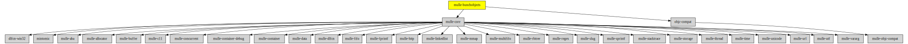

# mulle-bunchobjects

#### 👨‍👩‍👧‍👦 mulle-bunchobjects efficently allocate instances

Instead of allocating memory for each single object, this library allocates
memory for a bunch of objects. The memory can be released or reused, if all
objects of the bunch have been released.

* reduces time spent in malloc
* may waste memory


| Release Version                                       | Release Notes
|-------------------------------------------------------|--------------
|  [](//github.com/MulleFoundation/mulle-bunchobjects/actions) | [RELEASENOTES](RELEASENOTES.md) |


## Requirements

|   Requirement         | Release Version  | Description
|-----------------------|------------------|---------------
| [objc-compat](https://github.com/MulleFoundation/objc-compat) |  [](https://github.com/MulleFoundation/objc-compat/actions/workflows/mulle-sde-ci.yml) | 🔗 Glue for Objective-C code to support different Foundations
| [mulle-core](https://github.com/mulle-core/mulle-core) |  [](https://github.com/mulle-core/mulle-core/actions/workflows/mulle-sde-ci.yml) | 🌋 Almagamated library of mulle-core + mulle-concurrent + mulle-c

### You are here



## Add

Use [mulle-sde](//github.com/mulle-sde) to add mulle-bunchobjects to your project:

``` sh
mulle-sde add github:MulleFoundation/mulle-bunchobjects
```

## Install

Use [mulle-sde](//github.com/mulle-sde) to build and install mulle-bunchobjects and all dependencies:

``` sh
mulle-sde install --prefix /usr/local \
   https://github.com/MulleFoundation/mulle-bunchobjects/archive/latest.tar.gz
```

### Legacy Installation

Install the requirements:

| Requirements                                 | Description
|----------------------------------------------|-----------------------
| [objc-compat](https://github.com/MulleFoundation/objc-compat)             | 🔗 Glue for Objective-C code to support different Foundations
| [mulle-core](https://github.com/mulle-core/mulle-core)             | 🌋 Almagamated library of mulle-core + mulle-concurrent + mulle-c

Download the latest [tar](https://github.com/MulleFoundation/mulle-bunchobjects/archive/refs/tags/latest.tar.gz) or [zip](https://github.com/MulleFoundation/mulle-bunchobjects/archive/refs/tags/latest.zip) archive and unpack it.

Install **mulle-bunchobjects** into `/usr/local` with [cmake](https://cmake.org):

``` sh
cmake -B build \
      -DCMAKE_INSTALL_PREFIX=/usr/local \
      -DCMAKE_PREFIX_PATH=/usr/local \
      -DCMAKE_BUILD_TYPE=Release &&
cmake --build build --config Release &&
cmake --install build --config Release
```

## Author

[Nat!](https://mulle-kybernetik.com/weblog) for Mulle kybernetiK  


